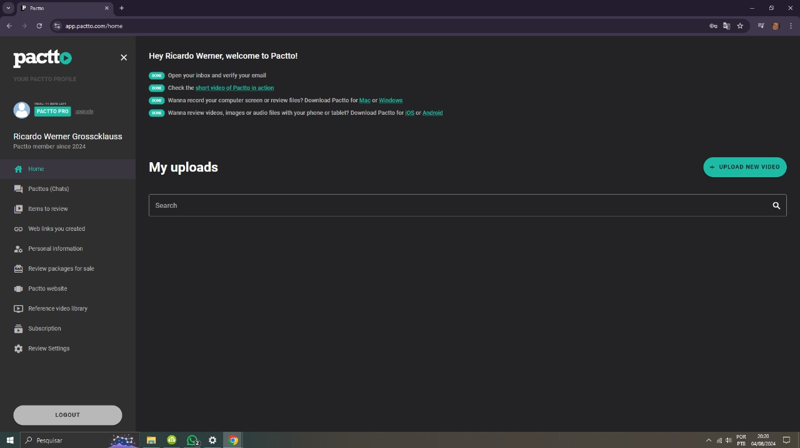
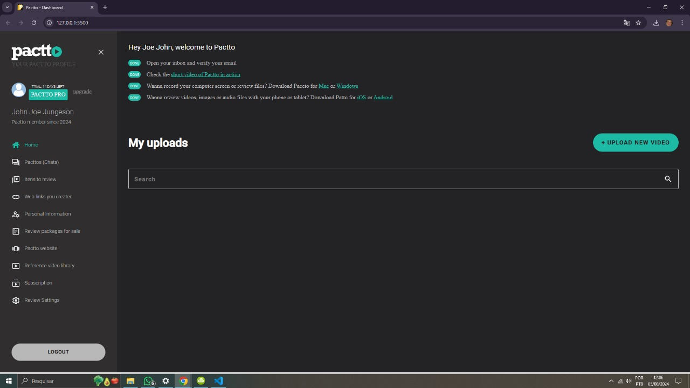

# Projeto de Desafio Prático Pactto - Front-End Júnior

### Reproduzir o dashboard da página inicial do website Pactto.com


### 🔗 Links
[](https://github.com/ricardo-werner)

[](https://www.linkedin.com/in/ricardo-werner)


Status - Concluído

### Demonstração

Página referência para o desafio
<p align="center">
  
</p>

Página da reprodução da página referência do desafio
<p align="center">
  
</p>


### O Desafio
Neste desafio foi proposto recriar o dashboard que aparece ao realizar o login na página inicial do website da Pactto.com, usando qualquer tecnologia de sua preferência.

### Requisitos do desafio prático

| Item  | Descrição                                            
| ----- | -----------------------------------------------------------------------------|
|  1    |  O dashboard deverá ser desenvolvida em HTML e CSS puro, Angular, React, etc.|  
|  2    |  O dashboard deverá seguir o layout da página principal do website.          |
|  3    |  Modelagem do layout, formatos, tipografias e cores conforme levantamento.   |


### Formato da Página

#### Lado esquerdo (SideBar)

| Item        | Descrição                                            
| ------------| ------------------------------------------------------------|
|  Cabeçalho  | Informações iniciais da empresa.                            |
|  Principal  | Inicio do detalhamento do usuário e o tempo sendo inscrito. |
|  Opções     | Lista com 10 opções.                                        |
|  Rodapé     | Botão de "logout".                                          |

#### Lado direito (Principal)

| Item        | Descrição                                            
| ------------| --------------------------------------------------------|
|  Cabeçalho  | Cumprimento de boas vinds com o nome do usuário.        |
|  Principal  | Lisa de tarefas (To Do) a serem realizadas pelo usuário.|
|  Upload     | botão de upload e área de pesquisa de vídeo.            |


### Plano do Projeto

No desenvolvimento desta página, coloquei em prática:

| Item  | Descrição                                            
| ----- | ------------- |
|  1    |  HTML         |
|  2    |  CSS          |
|  3    |  Skills       |

### Tecnologias utilizadas:

- Visual Studio Code
- Dev Tools (para levantamento dos requisitos do desafio)
- Documentações e videos
- ChatGPT


Este desafio foi fundamental para aprimorar minhas habilidades em HTML e CSS.
Ele demonstrou que o conhecimento adquirido no curso de formação pode ser efetivamente aplicado em situações reais. Percebi que, às vezes, tarefas aparentemente simples podem se revelar complicadas, exigindo recursos adicionais para encontrar a solução adequada.

A utilização de documentação, vídeos e tecnologias disponíveis, aliada ao pensamento organizacional, facilitou a compreensão das estruturas e a otimização das configurações no CSS. Além disso, o desafio incentivou a criação de uma página com uma estrutura que simplifique futuras manutenções.

## Para utilizar este projeto como base, faça o seguinte passo-a-passo:

Clone o projeto para a sua máquina
```bash
https://github.com/ricardo-werner/Desafio_Pratico_Pactto.git
```
- Rode o projeto

Rode o aplicativo na web ativando o Go Live no VS Code (click em cima do go live para ativar):
<p align="center">
  

<p align="center">
  


## Autor

Ricardo Werner
Dev Full-Stack em desenvolvimento
